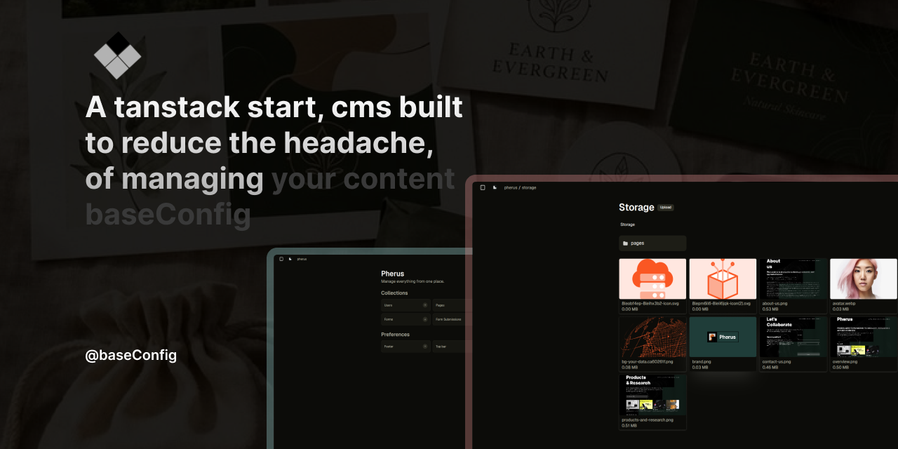
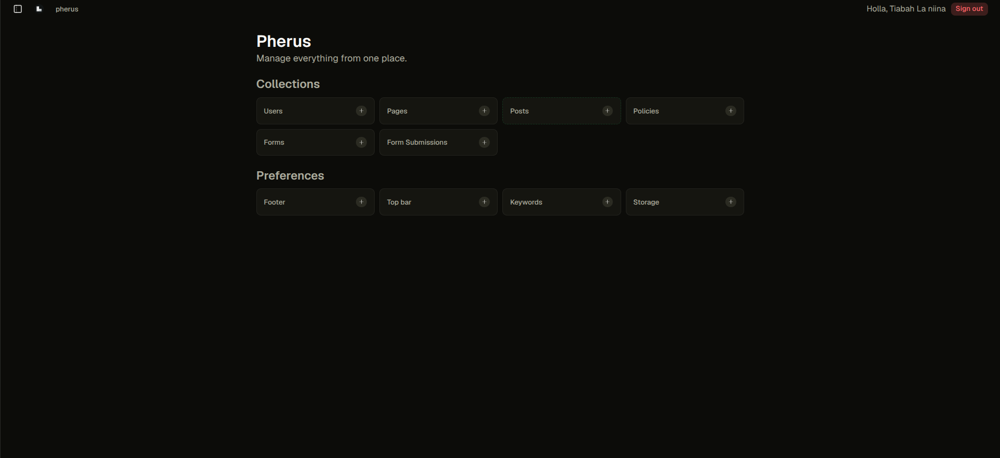
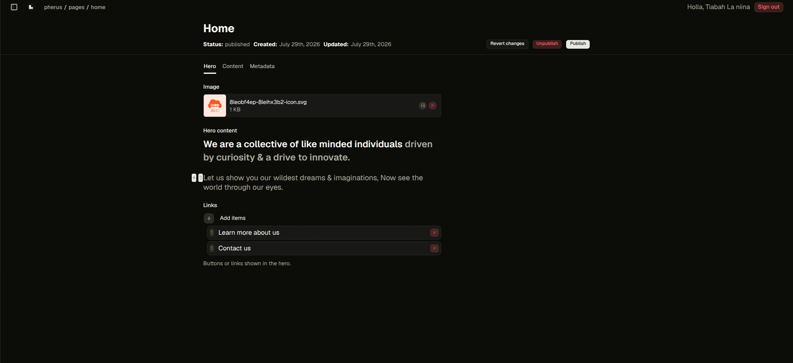
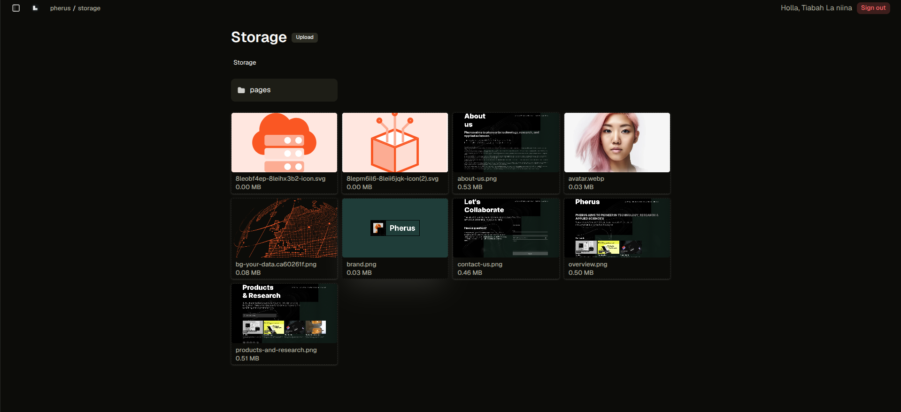
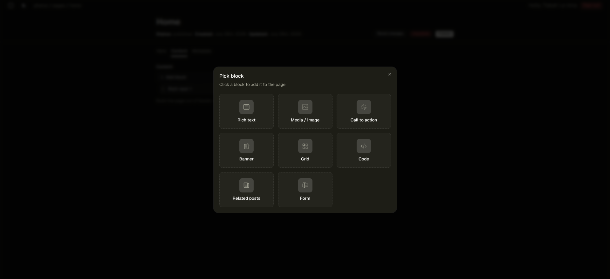
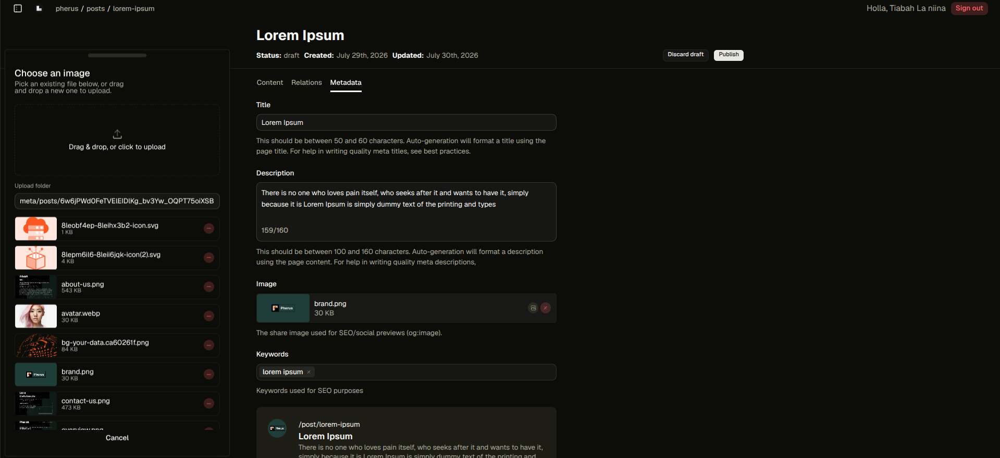

<p align="center" style="display: flex; border-radius: 5px; overflow: hidden; scrollbar-width: none; -ms-overflow-style: none;padding: p-0;">
  
</p>

<h1 align="center">baseConfig</h1>

<p style="display: flex; max-width: 32rem; margin-inline: auto; text-align: center;">
  Build content-driven apps with a config-driven CMS for TanStack Start. Local-first editing, edge-first architecture, no separate backend.
</p>

## Screenshots

<div style="display: flex; align-items: center; overflow-x: auto; gap: 0.75rem; border-radius: 5px; scrollbar-width: none; -ms-overflow-style: none;">
  <style>
    div::-webkit-scrollbar { display: none; }
  </style>

  
  
  
  
  
</div>


## Quick start

```bash
bun add @baseconfig/core @baseconfig/ui hono drizzle-orm better-auth
```

```ts
// base.config.ts — one call describes your whole app
import { baseConfig, defineCollection, defineGlobal } from '@baseconfig/core'

const posts = defineCollection({
	slug: 'posts',
	tabs: [
		{ id: 'content', fields: [{ type: 'text', name: 'title' }, { type: 'richtext', name: 'body' }] }
	]
})

const footer = defineGlobal({
	slug: 'footer',
	fields: [{ type: 'menu', name: 'links' }]
})

export default baseConfig({
	hostDomain: 'https://example.com',
	queryClient,
	auth: authClient, // better auth client
	config: { adminPath: 'admin' },
	collections: [posts],
	globals: [footer]
})
```

```ts
// api entry — the whole server-side surface is one call
import { createHandler } from '@baseconfig/core/api'

export default createHandler({
	db: drizzle(env.BASECONFIG),
	auth, // a betterAuth server, instance
	bindings: { r2: env.MEDIA, kv: env.CACHE, isdev: env.ENVIRONMENT === 'development' }
})
```

That's it — content CRUD (`/api/<collection>`, `/api/globals/<slug>`), the media library (`/api/storage/*`), and public unauthenticated media serving (`/api/cdn/*`) are all mounted for you. See [`config/CLAUDE.md`](./config/CLAUDE.md) and [`ui/CLAUDE.md`](./ui/CLAUDE.md) for the full internals.

## Development

```bash
bun install
bun run dev        # tsdown --watch across all three packages
bun run build       # tsdown build, real dist output
bun run typecheck   # tsc --noEmit per package
```

Every package builds to `dist/` via [tsdown](https://tsdown.dev) (rolldown-based) — nothing runs against raw `src/` at runtime. `dependencies`/`peerDependencies` are deliberately split by "does this package really need its own copy" (`neverBundle`) vs "should this get inlined" (`alwaysBundle`) — see each package's own `tsdown.config.ts`.

<h2>Features</h2>

<ul style="padding-left: 1.25rem; margin-top: 1rem;">
  <li style="margin-bottom: 0.75rem;">
    <strong>Config-driven collections &amp; globals</strong>: <code>defineCollection</code>/<code>defineGlobal</code>, one call (<code>baseConfig({...})</code>) describes your whole app's content model.
  </li>
  <li style="margin-bottom: 0.75rem;">
    <strong>~20 field types</strong>: text, textarea, richtext, checkbox, switch, date, keywords, upload, select, radio, email, number, password, code, json, slug, point, array, blocks, relationship, relations, meta, menu, links, plus layout-only row/collapsible/group/tabs/ui: and growing.
  </li>
  <li style="margin-bottom: 0.75rem;">
    <strong>Real content persistence</strong>: one D1 table generated per collection/global, raw SQL, a real Hono REST API (<code>/api/&lt;collection&gt;</code>, <code>/api/globals/&lt;slug&gt;</code>).
  </li>
  <li style="margin-bottom: 0.75rem;">
    <strong>Local-first admin editing</strong>: every keystroke writes to <code>localStorage</code> only; the network is touched exactly once, on Publish. Drafts survive a reload and show up in the list with a "Draft" badge even before they're ever published.
  </li>
  <li style="margin-bottom: 0.75rem;">
    <strong>A real, R2-backed media library</strong>: folder browsing, per-collection/per-document upload scoping, and a public, unauthenticated, two-layer-cached <code>/api/cdn/*</code> route for serving files back out.
  </li>
  <li style="margin-bottom: 0.75rem;">
    <strong>Auth via <a href="https://better-auth.com" style="color: #0284c7; text-decoration: underline;">better-auth</a></strong>: passkeys, 2FA, social sign-in, username auth, and admin roles all come for free by delegating to a real, actively maintained auth library instead of reinventing one.
  </li>
  <li style="margin-bottom: 0.75rem;">
    <strong>A full admin UI shell</strong>: dashboard, collection list/table, a tabbed document editor, a Tiptap v3 rich text editor, a block-based page builder (richtext/media/cta/banner/grid/code/relatedPosts blocks), nav menu + link field composites, and an SEO meta fields composite.
  </li>
  <li style="margin-bottom: 0.75rem;">
    <strong>A real plugin mechanism</strong>: <code>endpointFactories</code>/<code>hooks</code>/<code>blocks</code> registration, proven out by <a href="./plugin-form-builder" style="color: #0284c7; text-decoration: underline;"><code>@baseconfig/plugin-form-builder</code></a> (a forms/form-submissions collection pair plus a public contact-form block).
  </li>
  <li style="margin-bottom: 0.75rem;">
    <strong>One Cloudflare Worker</strong>: content, media, admin UI, and your public site all deploy together; no separate Node server, no separate database service.
  </li>
  <li style="margin-bottom: 0.75rem;">
    <strong>Edge caching where it counts</strong>: the CDN route caches at both the browser (<code>Cache-Control</code>) and the Workers edge (<code>caches.default</code>) layers.
  </li>
</ul>

<h2>Roadmap</h2>
<p>An honest list of what's not there yet, roughly in priority order:</p>

<ul style="list-style-type: none; padding-left: 0; margin-top: 1rem;">
  <li style="display: flex; align-items: flex-start; gap: 0.5rem; margin-bottom: 0.75rem;">
    <input type="checkbox" disabled style="margin-top: 0.25rem; cursor: not-allowed;" />
    <span><strong>Real per-field/per-document access control</strong> today it's one blunt gate (<code>role === 'admin'</code>) for all writes.</span>
  </li>
  <li style="display: flex; align-items: flex-start; gap: 0.5rem; margin-bottom: 0.75rem;">
    <input type="checkbox" disabled style="margin-top: 0.25rem; cursor: not-allowed;" />
    <span><strong>Deep-field querying</strong> — <code>where</code> clauses currently only reach top-level columns (<code>status</code>/<code>slug</code>), not into a document's own JSON <code>data</code>. This is the single biggest daily-use gap, and blocks a <code>join</code> field type too.</span>
  </li>
  <li style="display: flex; align-items: flex-start; gap: 0.5rem; margin-bottom: 0.75rem;">
    <input type="checkbox" disabled style="margin-top: 0.25rem; cursor: not-allowed;" />
    <span><strong>A generic, registry-driven relationship picker</strong> — today it's three hardcoded <code>useLiveQuery</code> calls, not derived from the collection registry, so a plugin-registered collection isn't relatable yet.</span>
  </li>
  <li style="display: flex; align-items: flex-start; gap: 0.5rem; margin-bottom: 0.75rem;">
    <input type="checkbox" disabled style="margin-top: 0.25rem; cursor: not-allowed;" />
    <span><strong>KV edge-cache for content reads</strong> the CDN route already has this; <code>/api/&lt;collection&gt;</code> reads still hit D1 directly every time.</span>
  </li>
  <li style="display: flex; align-items: flex-start; gap: 0.5rem; margin-bottom: 0.75rem;">
    <input type="checkbox" disabled style="margin-top: 0.25rem; cursor: not-allowed;" />
    <span><strong>Image variants/focal point</strong> for uploads — currently one file in, one URL out, no resizing.</span>
  </li>
  <li style="display: flex; align-items: flex-start; gap: 0.5rem; margin-bottom: 0.75rem;">
    <input type="checkbox" disabled style="margin-top: 0.25rem; cursor: not-allowed;" />
    <span><strong>Server-side version history and scheduled publish</strong> — local-first drafting solves "don't lose my work," not "what did this look like last week" or "publish this at 9am."</span>
  </li>
  <li style="display: flex; align-items: flex-start; gap: 0.5rem; margin-bottom: 0.75rem;">
    <input type="checkbox" disabled style="margin-top: 0.25rem; cursor: not-allowed;" />
    <span><strong>A wider plugin surface</strong> the current registration hooks cover what the form-builder plugin needs; a real plugin ecosystem needs more surface area than that.</span>
  </li>
  <li style="display: flex; align-items: flex-start; gap: 0.5rem; margin-bottom: 0.75rem;">
    <input type="checkbox" disabled style="margin-top: 0.25rem; cursor: not-allowed;" />
    <span><strong>Localization (i18n)</strong> and <strong>live preview</strong> — neither exists yet.</span>
  </li>
</ul>

<p>Contributions on any of these — or on anything else in the field/admin-UI vocabulary — are genuinely welcome; see below.</p>

## Contributing

Issues and PRs are welcome. To get set up:

```bash
git clone git@github.com:phe-rus/base-config.git
cd base-config
bun install
bun run dev
```

- Formatting/linting is [Biome](https://biomejs.dev) (`bunx biome check .` / `bunx biome format --write .`).
- Each package typechecks standalone (`bun run typecheck`, from the package or the repo root via `turbo`).
- Keep `dependencies` vs `peerDependencies` honest: anything the package actually imports at runtime (not just types) should be a real `dependency`, since the isolated linker doesn't resolve peers for a package's own standalone build.

## License

[MIT](./LICENSE)

## 👏 Thanks to all our contributors

